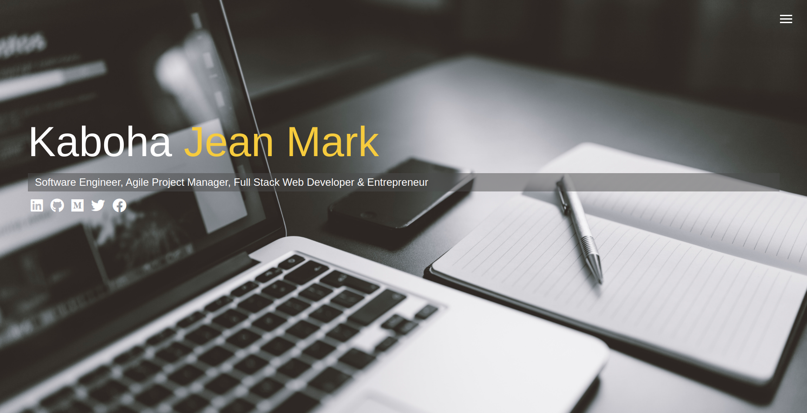
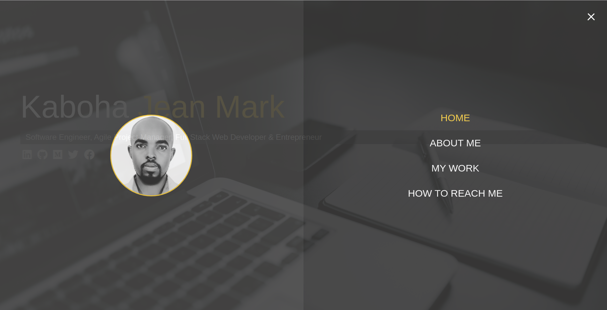
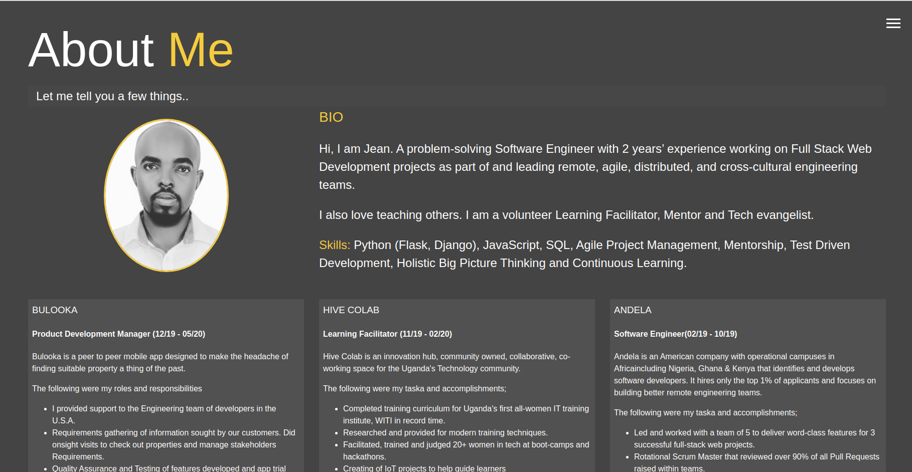
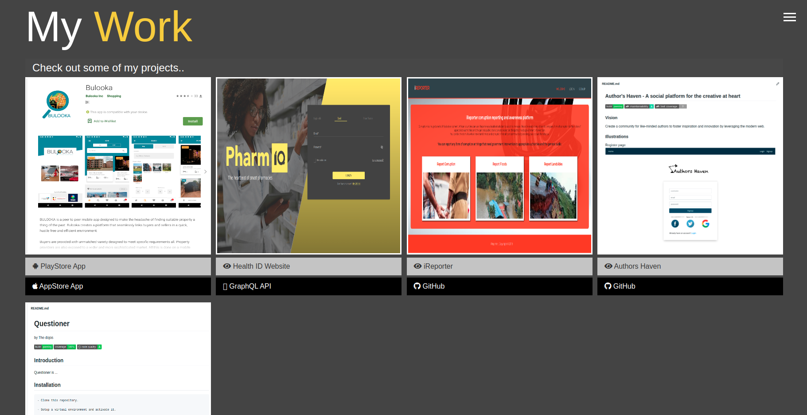

## Professional Portfolio

### Rationale

Create a personal website that contains CV relevant information for recruiters.

### Illustrations
Home page

Menu Overlay

About

My Work Projects

### Demo
A live demo of the application is found [here](https://kabohajeanmark.github.io/my-portfolio/)

### Technologies required
- HTML5
- CSS3
- JavaScript
- Sass
- npm 

### Getting started
1. Clone this [repository](https://kabohajeanmark.github.io/my-portfolio/)

2. Use your package manager to install dependencies
- `npm install`

3. Start up the server
- `npm run sass`
